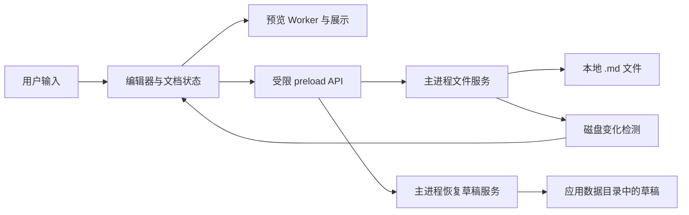

# 本地 Markdown 编辑器：首版设计

日期：2026-09-23
状态：设计已在对话中逐节确认，等待书面规格审查

## 1. 产品目标

面向在 macOS 和 Windows 上写作的个人用户。用户直接打开和编辑本地 `.md` 文件，在源码区输入 Markdown，在相邻区域实时查看预览。首版优先保证打开即写、保存状态清楚、编辑内容在异常情况下可找回。

文件系统中的 `.md` 是文档的正式来源。应用不引入专有文档格式，也不要求把文件导入应用数据库。应用数据目录只存放偏好、最近文件和恢复草稿。

### 首版主要场景

1. 从系统文件管理器或应用“打开”命令载入一个 `.md` 文件。
2. 在源码区持续编辑，按需显示或隐藏实时预览。
3. 在停止输入约 2 秒后自动保存；`Cmd/Ctrl+S` 立即发起保存。
4. 关闭并重新打开应用，磁盘文件内容与已保存状态一致；若上次写入未完成，可选择恢复草稿。
5. 文件被其他程序修改时，应用提示冲突，由用户决定重新载入或将当前内容另存副本。

## 2. 功能范围

| 首版包含 | 首版暂缓 |
| --- | --- |
| 新建、打开、保存、另存为、最近文件、系统 `.md` 文件关联 | 文件夹笔记库、多标签与跨文件搜索 |
| 单篇文档源码编辑、实时预览、预览显隐 | 所见即所得编辑 |
| 常用 Markdown 快捷键、查找替换、字数统计 | 云同步、多人协作 |
| CommonMark 与常用 GFM：表格、任务列表、删除线、围栏代码块 | 插件系统、复杂导出与发布 |
| 相对于当前 `.md` 所在目录解析本地图片与链接 | 远程图片自动加载 |
| 自动保存、恢复草稿、外部修改冲突提示 | 文档历史与版本管理界面 |

首版每个窗口只编辑一篇文档。打开另一篇文档时，先确保当前文档已保存，或能从恢复草稿找回。未命名文档在用户指定路径前只保存恢复草稿，不自动创建 `.md` 文件。

## 3. 交互设计

主界面由顶部文件名与保存状态、源码编辑区、可显隐的预览区、底部字数与光标位置组成。默认显示左右分栏；隐藏预览时编辑区占满可用宽度。预览更新与输入解耦，较大文档解析不能阻塞键入。

保存状态包含：编辑中、正在保存、已保存、保存失败、磁盘冲突。“已保存”只表示当前编辑版本已成功写入磁盘；有更新的编辑版本时，旧版本的保存成功不能使状态变成“已保存”。失败或冲突状态应给出可操作的下一步。

点击预览中的外部 `https:` 链接时交给系统浏览器。相对链接基于当前文档目录解析；本地图片只通过受限的资源通道读取。首版不自动读取文档目录树以外的资源，遇到 `../` 路径或指向目录外的符号链接时显示受限提示。未命名文档没有基准目录，保存前不解析相对资源。远程图片默认显示占位内容，不自动请求网络。

## 4. 技术路线与模块边界

选择 Electron + TypeScript。界面使用 React，源码编辑使用 CodeMirror 6；预览使用 remark、remark-gfm、remark-rehype 与 rehype-sanitize。选择 Electron 的原因是首版需要在 macOS 和 Windows 共用桌面文件处理与 Chromium 预览实现。

| 路线 | 优点 | 首版代价 |
| --- | --- | --- |
| Electron（选择） | 两个平台共享 Chromium 行为与 JavaScript 文件处理代码 | 安装包和运行资源开销较高 |
| Tauri | 使用系统 WebView，安装包通常更小 | Rust 桥接与 macOS、Windows 的 WebView 差异需要额外验证 |
| 双平台原生开发 | 系统界面与文件体验可分别深度定制 | 两套实现和测试成本较高 |

若后续性能测量表明 Electron 的代价不能接受，再评估迁移。

模块职责：

- **文档状态（界面进程）**：持有当前文本、文件路径、编辑版本号、已保存版本号、上次读取的磁盘指纹副本和状态标记；向编辑器与预览提供同一份文本。
- **编辑器（界面进程）**：处理键入、选择、Markdown 快捷键和查找替换；不直接访问文件系统。
- **预览（界面进程的 Web Worker 与展示层）**：在 Worker 中将 Markdown 转为受清理的展示内容；展示层负责相对资源和链接的受限解析，不执行文档内脚本。
- **文件服务（主进程）**：文件对话框、UTF-8 解码与编码、读写串行化、外部变化检查、保存结果；它是唯一可写 `.md` 的模块，并维护用于冲突检查的权威磁盘指纹。
- **恢复草稿服务（主进程）**：保存未落盘的文本快照，在启动时与磁盘版本比对并提供恢复入口。
- **preload API**：只暴露打开、保存、另存为、读取受限本地资源、恢复草稿等明确操作。启用 context isolation 和 renderer sandbox，不给界面通用 Node.js 或任意 IPC 权限。

### 文档状态契约

`DocumentSession` 包含 `path | null`、`text`、`revision`、`persistedRevision`、`diskFingerprint`、`lineEnding`、`hasBom` 和 `saveState`。`revision` 每次编辑递增；只有对应版本写入成功才更新 `persistedRevision`。磁盘指纹由主进程根据文件内容计算并维护，界面保存其副本用于显示；主进程保存队列不采用请求里可能过时的副本判断冲突。

## 5. 打开、预览与保存数据流

### 打开

主进程读取文件字节，验证 UTF-8（允许 BOM），记录文件内容指纹和原有换行风格，再把文本交给文档状态。无法解码的文件显示错误，不以替换字符打开后覆盖原文件。统一使用 LF 或 CRLF 的文件在保存时保留其换行风格；混合换行文件需提示用户首版无法保证逐行原样保留，保存前必须另存副本或明确确认。

### 预览

编辑器变动立即更新文档状态；预览在停止输入约 150 毫秒后把该版本的文本发给 Web Worker 解析，输入线程不承担 Markdown 解析。解析结果若对应旧版本则丢弃。Markdown 中的原始 HTML 不作为可执行内容渲染，生成的 HTML 经清理后再展示。相对资源路径限制在文档所在目录及其子目录；协议和路径需校验，不能借预览读取任意本地文件。

### 自动保存与手动保存

自动保存于停止输入约 2 秒后触发；手动保存立即触发。两者进入同一条按文档串行的保存队列，始终携带目标 `revision`，避免较早请求覆盖较新请求。未命名文档的自动保存只更新恢复草稿；手动保存先要求用户指定 `.md` 路径。

1. 写入对应版本的恢复草稿。
2. 读取目标文件当前内容并与 `diskFingerprint` 比较。若发现外部改动，停止覆盖并进入冲突状态。
3. 在目标文件同目录写临时文件，完成写入并同步后替换目标文件。替换行为需分别在 macOS 和 Windows 验证；失败时保留恢复草稿和原文件。
4. 写入成功后更新磁盘指纹及 `persistedRevision`。如果期间又有编辑，继续显示“编辑中”，并安排下一轮保存。
5. 确认磁盘文件与最新编辑版本一致后清理相应恢复草稿。应用崩溃若发生在替换成功与清理之间，启动时用内容指纹识别重复草稿。

编辑期间在停止输入约 500 毫秒后更新恢复草稿，窗口失焦或关闭前也发起一次草稿写入；关闭前等待写入结果。进程突然终止时，最后一次草稿写入之后的输入仍可能丢失，因此界面不能把“草稿已备份”与“磁盘已保存”混为一谈。

### 外部修改与冲突

文件变化监听用于尽早提醒，保存前的内容指纹比较用于最终检查。没有本地未保存修改时，可提示并重新载入外部版本；有本地修改时，暂停自动保存，提供“重新载入磁盘文件”和“将当前内容另存副本”。两种选择执行前都保留可恢复的当前草稿。

保存前比较与替换不是跨应用的原子操作：其他程序若恰好在检查和替换之间写入，首版无法绝对防止竞态。验收要求覆盖可检测的外部修改；对极短竞态在实现阶段通过平台测试评估，并在需要时增加版本备份策略。

## 6. 错误处理

- **权限不足、磁盘已满、文件被占用、路径失效**：停止保存，保持编辑文本和恢复草稿，明确显示失败原因；允许重新尝试或另存为。
- **符号链接文档**：首版不通过临时文件替换符号链接路径；提示用户将内容另存为普通文件，避免意外替换链接本身。
- **文件被外部改动**：停止自动覆盖，显示冲突选择；文件监听事件若由应用自身保存引起，通过内容指纹识别后忽略。
- **恢复草稿与磁盘版本不同**：启动时显示两者的修改时间及恢复入口；恢复操作先在编辑区载入草稿，不立即覆盖磁盘。
- **预览解析或资源读取失败**：错误限制在预览区，不影响源码编辑和保存；失败的图片显示占位说明。
- **潜在危险内容**：预览不执行脚本；阻止不受支持的 URL 协议、任意窗口导航和越界文件路径。界面进程无直接文件系统权限。

## 7. 验收与验证

### 必须通过的用户场景

1. 在 macOS 与 Windows 上分别完成“打开 UTF-8 `.md` → 编辑 → 自动保存 → 退出 → 重开”，磁盘文本与编辑结果一致。
2. `Cmd/Ctrl+S` 保存当前编辑版本；连续快速输入时，较早保存结果不能将较新内容标成“已保存”。
3. 修改已打开文件的磁盘内容后，自动保存不覆盖已检测到的外部改动，用户能重新载入或另存副本。
4. 模拟写入失败、文件移动或权限变化后，用户仍能复制或另存当前编辑内容；重启后能恢复已写入恢复草稿的版本。
5. UTF-8 BOM 和统一的 LF/CRLF 文件经过编辑保存后维持对应格式；无法解码的文件不会被覆写。
6. 表格、任务列表、围栏代码块和本地相对图片能按预期预览；文档中的脚本及危险链接不能在应用内执行。
7. 用较大的 Markdown 文件验证编辑输入不被预览计算阻塞，记录 macOS 与 Windows 的实际测量结果；若仍有明显卡顿，需在发布前定位并修复。
8. 在两种系统上验证 `.md` 文件关联能打开指定文件；文档目录外的相对资源不会被预览自动读取。

### 测试层次

- 单元测试：版本状态机、换行与 BOM 转换、链接与资源路径校验、预览清理。
- 主进程集成测试：临时文件保存、恢复草稿、外部修改冲突、写入失败。
- 双平台端到端测试：打开、编辑、保存、重启、崩溃恢复和预览安全场景。

## 8. 后续迭代方向

首版验证写作与保存流程后，再按真实使用反馈评估多标签、文件夹导航与跨文件搜索。导出、所见即所得、同步与协作分别涉及新的数据流和冲突模型，单独设计。

## 9. 参考依据

- [Electron 框架与跨平台支持](https://www.electronjs.org/docs/latest)
- [Electron 进程模型](https://www.electronjs.org/docs/latest/tutorial/process-model)
- [Electron 安全建议](https://www.electronjs.org/docs/latest/tutorial/security)
- [CodeMirror Markdown 支持](https://github.com/codemirror/lang-markdown)
- [remark 与 CommonMark](https://github.com/remarkjs/remark/blob/main/readme.md)
- [remark-gfm](https://github.com/remarkjs/remark-gfm)
- [rehype-sanitize](https://github.com/rehypejs/rehype-sanitize/blob/main/readme.md)
- [Tauri 技术路线对照](https://v2.tauri.app/start/)
